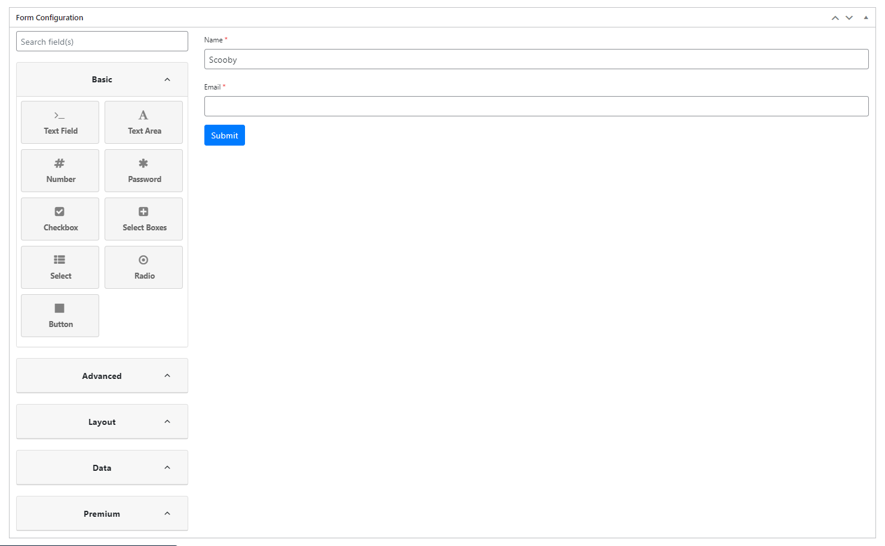
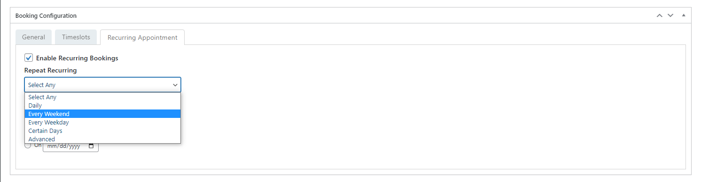
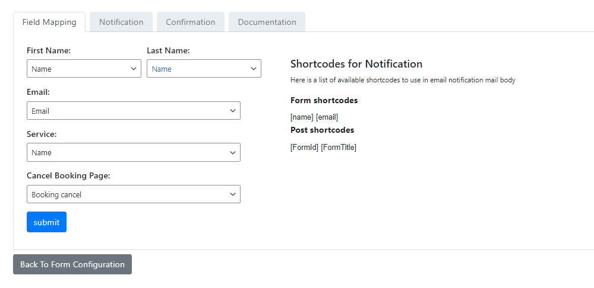
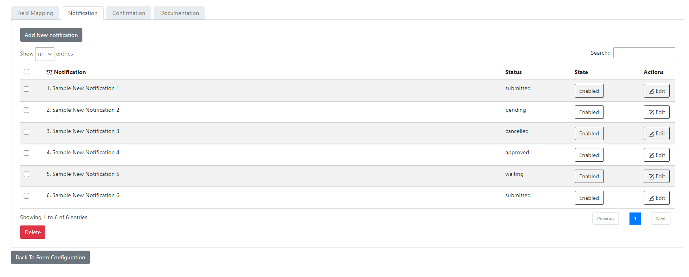
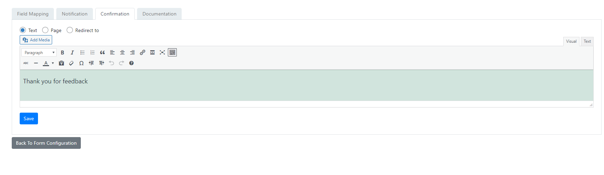
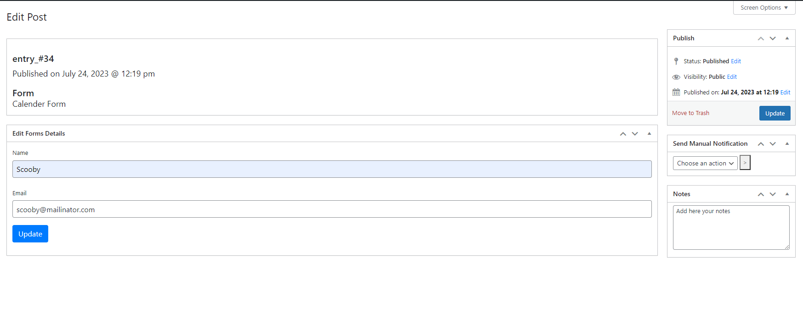
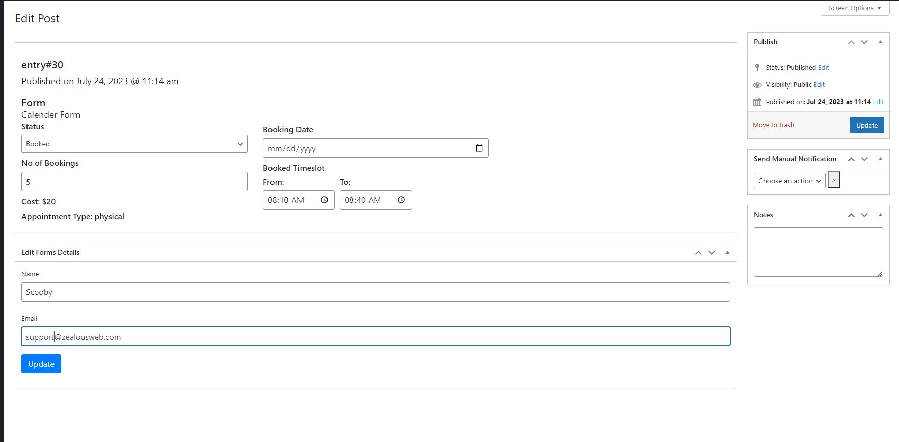
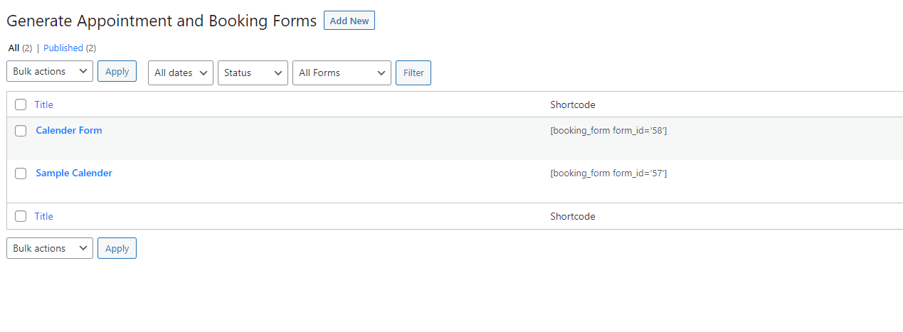
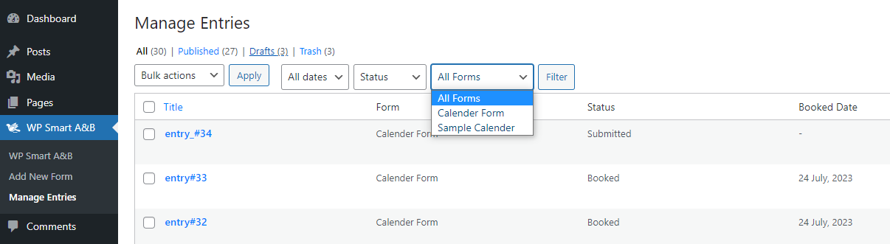

# smart-appointment-booking

**Description**

Smart Appointment & Booking all-in-one plugin efficiently manages appointments with customizable forms, seamless booking, and waitlist management.
ZealousWeb Technologies has come up with a powerful solution – Smart Appointment & Booking. This all-in-one plugin efficiently manages appointments with customizable forms, seamless booking. It enhances customer experiences and streamlines processes for service-based businesses, appointment management, and booking services.
# Features of Smart Appointment & Booking 

- Create and Configure Forms and customize them as needed, and configure the thank-you message.
- You can also set page redirection upon form submission.
- Its not just ordinary forms! You can create specialized booking forms tailored to your unique requirements.
- Set up booking calendar settings, and customize the thank-you message or redirection upon successful bookings.
- In admin you can manage and track booking entries in the backend effortlessly.
- We are Offer both physical and virtual appointments to your customers.
- Share Google links or Zoom links via email to facilitate seamless virtual interactions.
- The waitlist feature enables customers to join a waitlist for full bookings. You can later approve the booking and send notification.
- From admin you can Modifications and Cancellations the Bookings.
- Additionally, your staff can efficiently reschedule or cancel bookings as necessary.
- View and Edit Booking Entries and Form Entries.
- Update status, booking dates, and send manual notifications to stay in control.
- Guest Check-In feature allow anyone to submit forms without the need for account creation.

 [Learn more about the Pro version](https://store.zealousweb.com/smart-appointment-booking-pro)

 **Features of Smart Appointment & Booking Pro**
 
We have released the PRO version of this plugin with extra advantageous features added. PRO Version 1.0.0 Released.

- Stripe Payment Gateway: Secure payment processing.
- Display to Logged-In Users: Show forms to registered users.
- User Account Creation: Allow new user registration.
- Send Username and Password: Automatically send login credentials.
- Waitlist: Let users join a waitlist for fully booked slots.
- Booking Management: Track and manage appointments in the admin backend.Physical and Virtual Appointments: Offer both types to customers.

**Plugin Requirement**

PHP version : 5.6 and latest

WordPress : WordPress 5.9 and latest

# How To Use

**Add New Booking Form and Configure fields and Hit save. Form will be automatically updated and  saved**

**Configure Booking Setting for each Form**

**You can set booking appoint as recurring event: Daily, Every  weekdays, Every weekends, Certain Weekdays, Advanced**

**Create Notifications and confirmations:** After Submitting form display message,Or redirect to page or url with url params(formid, booked_id)
Map Fields to Send Notifications catching email id, services you have set up via form

**Create new Notifications based on status, enable and disable it as per your need**

**Set Confirmations:** Show text message after successful submission Or you may redirect to any page.
You can review documentation form form and notification, booking calender. You may use the available shortcodes that will fetch values in notifications

**Admin can review entries, Edit and filter the entries from backend under booking entries menu**

On viewing you will have edit option, where you can update the booking details, or form details
On updating status, notification will be sent to user

**To display booking calendar on frontend, Use the form shortcode on the required page**

**You can send manual notifications as well.**
User Receives mail notification where he can cancel the appointment, You need to set shortcodes as per your requirement in notification template.
And admin wil receive notification on cancelling appointment.

**Filter booking entries according status,forms**

